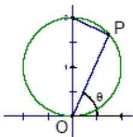

> [!faq]- 2007年上海高考数学真题（理科）试卷（word解析版）解析
>
> > [!success]- **【答案】** 【
>
> > [!note]- **【分析】**
> > 本题未单列分析。
>
> > [!note]- **【解析】**
> > $\left|OP\right|=2\cos(\frac{\pi}{2}-\theta)=2\sin\theta,\theta\in(0,\pi)$
> >
> > 
> >
> > 二．选择题（本大题满分16分）本大题共有4题，每题都给出代号为A，B，C，D的四个结论，其中有且只有一个结论是正确的，必须把正确结论的代号写在题后的圆括号内，选对得4分，不选、选错或者选出的代号超过一个（不论是否都写在圆括号内），一律得零分.
