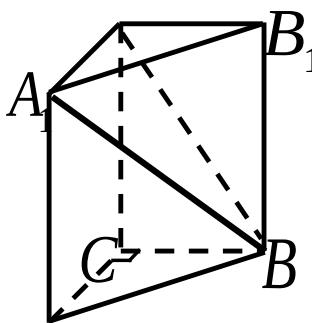
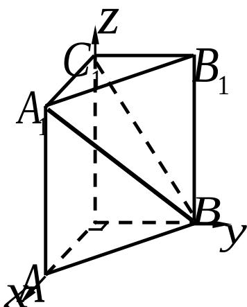

> [!faq]- 2007年上海高考数学真题（理科）试卷（word解析版）解析
>
> > [!success]- **【答案】** 详见解析
>
> > [!note]- **【分析】**
> > 本题未单列分析。
>
> > [!note]- **【解析】**
> > 法一：由题意，可得体积 $V=CC_{1}\square S_{\triangle ABC}=CC_{1}\square\frac{1}{2}\square AC\square BC=\frac{1}{2}CC_{1}=1$ ，
> >
> > $\therefore AA_{1} = CC_{1} = 2 \cdot \text{连接} BC_{1} \cdot \because A_{1}C_{1} \perp B_{1}C_{1}, A_{1}C_{1} \perp CC_{1},$ $\therefore A_{1}C_{1} \perp \text{平面} BB_{1}C_{1}C,$
> >
> > 
> >
> > ∴ $\angle A_{1}BC_{1}$ 是直线 $A_{1}B$ 与平面 $BB_{1}C_{1}C$ 所成的角.
> >
> > $$
> > B C _ {1} = \sqrt {C C _ {1} ^ {2} + B C ^ {2}} = \sqrt {5}, \therefore \tan \angle A _ {1} B C _ {1} = \frac {A _ {1} C _ {1}}{B C _ {1}} = \frac {1}{\sqrt {5}},
> > $$
> >
> > 则 $\angle A_{1}BC_{1} = \arctan \frac{\sqrt{5}}{5}$ 即直线 $A_{1}B$ 与平面 $BB_{1}C_{1}C$ 所成角的大小为 $\arctan \frac{\sqrt{5}}{5}$
> >
> > 法二：由题意，可得
> >
> > 体积 $V = CC_{1} \square S_{\Delta ABC} = CC_{1} \square \frac{1}{2} \square AC \square BC = \frac{1}{2} CC_{1} = 1$ ,
> >
> > $$
> > \therefore C C _ {1} = 2 ^ {\prime}
> > $$
> >
> > 如图，建立空间直角坐标系．得点 $B(0,1,0)$ ，
> >
> > $C_{1}(0,0,2)$ ， $A_{1}(1,0,2)$ ．则 $A_{1}B=(-1,1,-2)$
> >
> > 
> >
> > 平面 $BB_{1}C_{1}C$ 的法向量为 $n=(1,0,0)$ .
> >
> > 设直线 $A_{1}B$ 与平面 $BB_{1}C_{1}C$ 所成的角为 $\theta$ ， $\overrightarrow{A_1B}$ 与 $\vec{n}$ 的夹角为 $\varphi$
> >
> > 则 $\cos\varphi=\frac{A_{1}B\|n}{\left|A_{1}B\|\|n\right|}=-\frac{\sqrt{6}}{6},\quad\therefore\quad\sin\theta\neq\cos\varphi|=\frac{\sqrt{6}}{6},\quad\theta=\arcsin\frac{\sqrt{6}}{6},$
> >
> > 即直线 $A_{1}B$ 与平面 $BB_{1}C_{1}C$ 所成角的大小为 $\arcsin\frac{\sqrt{6}}{6}$ .
