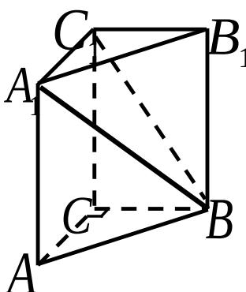

<!-- question-source:start -->
16. （本题满分 12 分）

如图，在体积为 1 的直三棱柱 $ABC - A_{1}B_{1}C_{1}$ 中，

$\angle ACB = 90^{\circ}$ ， $AC = BC = 1$ 求直线 $A_{1}B$ 与

平面 $BB_{1}C_{1}C$ 所成角的大小（结果用反三角函数值表示）

## 17. (本题满分 14 分)

在 $\triangle ABC$ 中， $a, b, c$ 分别是三个内角 $A, B, C$ 的对边。若 $a = 2, C = \frac{\pi}{4}, \cos \frac{B}{2} = \frac{2\sqrt{5}}{5}$ ，求 $\triangle ABC$ 的面积 $S$ 。
<!-- question-source:end -->

![[高中/真题/按年份分类/2007/2007年上海高考数学真题_理科_试卷_word解析版_/解答题/题目/answers/Q00025923A1.md]]
