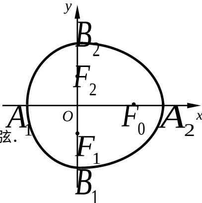

<!-- question-source:start -->
21. （本题满分 18 分）本题共有 3 个小题，第 1 小题满分 4 分，第 2 小题满分 6 分，第 3 小题满分 8 分.

我们把由半椭圆 $\frac{x^{2}}{a^{2}}+\frac{y^{2}}{b^{2}}=1\quad(x\geq0)$ 与半椭圆 $\frac{y^{2}}{b^{2}}+\frac{x^{2}}{c^{2}}=1\quad(x\leq0)$

合成的曲线称作 “果圆”，其中 $a^{2}=b^{2}+c^{2}$ ，a>0，b>c>0。

如图，点 $F_{0}$ ， $F_{1}$ ， $F_{2}$ 是相应椭圆的焦点， $A_{1}$ ， $A_{2}$ 和 $B_{1}$ ， $B_{2}$ 分别是“果圆”

与 $x$ ， $y$ 轴的交点.

(1) 若 $\triangle F_{0}F_{1}F_{2}$ 是边长为 1 的等边三角形，求“果圆”的方程；

(2) 当 $\left|A_{1}A_{2}\right|>\left|B_{1}B_{2}\right|$ 时，求 $\frac{b}{a}$ 的取值范围；

(3) 连接 “果圆” 上任意两点的线段称为 “果圆” 的弦.
试研究：是否存在实数 k，使斜率为 k 的 “果圆”
平行弦的中点轨迹总是落在某个椭圆上？若存在，
求出所有可能的 k 值；若不存在，说明理由.

# 2007 年普通高等学校招生全国统一考试（上海卷）

# 数学试卷（理工农医类）

(满分 150 分，考试时间 120 分钟)

## 考生注意
<!-- question-source:end -->

![[高中/真题/按年份分类/2007/2007年上海高考数学真题_理科_试卷_word解析版_/解答题/题目/answers/Q00025927A1.md]]
