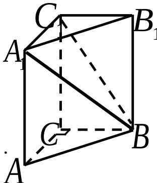

<!-- question-source:start -->
17. 如图，在体积为 1 的直三棱柱 $ABC - A_{1}B_{1}C_{1}$ 中，

$\angle ACB = 90^{\circ}, AC = BC = 1$ 求直线 $A_{1}B$ 与

$$
B B _ {1} C _ {1} C
$$

【
<!-- question-source:end -->

![[高中/真题/按年份分类/2007/2007年上海高考数学真题_理科_试卷_word解析版_/解答题/题目/answers/Q00025928A1.md]]
