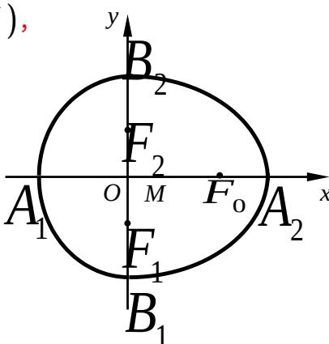

> [!faq]- 2007年上海高考数学真题（理科）试卷（word解析版）解析
>
> > [!success]- **【答案】** 详见解析
>
> > [!note]- **【分析】**
> > 本题未单列分析。
>
> > [!note]- **【解析】**
> > （1）∵ $F_{0}(c,0)$ ， $F_{1}\left(0,-\sqrt{b^{2}-c^{2}}\right)$ ， $F_{2}\left(0,\sqrt{b^{2}-c^{2}}\right)$
> >
> > $$
> > \therefore \left| F _ {0} F _ {2} \right| = \sqrt {\left(b ^ {2} - c ^ {2}\right) + c ^ {2}} = b = 1, \left| F _ {1} F _ {2} \right| = 2 \sqrt {b ^ {2} - c ^ {2}} = 1,
> > $$
> >
> > 于是 $c^{2}=\frac{3}{4}$ ， $a^{2}=b^{2}+c^{2}=\frac{7}{4}$ ，所求“果圆”方程为
> >
> > 
> >
> > $$
> > \frac {4}{7} x ^ {2} + y ^ {2} = 1 (x \geq 0), y ^ {2} + \frac {4}{3} x ^ {2} = 1 (x \leq 0)
> > $$
> > (2) 由题意, 得 $a + c > 2b$ , 即 $\sqrt{a^2 - b^2} > 2b - a$ .
> >
> > $\because (2b)^{2} > b^{2} + c^{2} = a^{2}, \therefore a^{2} - b^{2} > (2b - a)^{2}$ , 得 $\frac{b}{a} < \frac{4}{5}$ .
> >
> > $$
> > b ^ {2} > c ^ {2} = a ^ {2} - b ^ {2}, \quad \therefore \quad \frac {b ^ {2}}{a ^ {2}} > \frac {1}{2} \cdot \quad \therefore \quad \frac {b}{a} \in \left(\frac {\sqrt {2}}{2}, \frac {4}{5}\right) \cdot
> > $$
> > (3) 设 “果圆” C 的方程为 $\frac{x^{2}}{a^{2}} + \frac{y^{2}}{b^{2}} = 1 \quad (x \geq 0)$ ， $\frac{y^{2}}{b^{2}} + \frac{x^{2}}{c^{2}} = 1 \quad (x \leq 0)$ .
> >
> > 记平行弦的斜率为 k .
> >
> > 当 $k = 0$ 时，直线 $y = t(-b \leq t \leq b)$ 与半椭圆 $\frac{x^2}{a^2} + \frac{y^2}{b^2} = 1 (x \geq 0)$ 的交点是
> >
> > $P\left(a\sqrt{1 - \frac{t^2}{b^2}}\right)$ ，与半椭圆 $\frac{y^2}{b^2} +\frac{x^2}{c^2} = 1$ （ $x\leq 0$ ）的交点是 $Q\left(-c\sqrt{1 - \frac{t^2}{b^2}}\right)$ 。
> >
> > ∴ P, Q 的中点 $M(x,y)$ 满足 $\left\{\begin{aligned}x&=\frac{a-c}{2}\sqrt{1-\frac{t^{2}}{b^{2}}},\\ y&=t,\end{aligned}\right.$ 得 $\frac{x^{2}}{\left(\frac{a-c}{2}\right)^{2}}+\frac{y^{2}}{b^{2}}=1$ .
> >
> > $$
> > \because a <   2 b ^ {\prime} \therefore \left(\frac {a - c}{2}\right) ^ {2} - b ^ {2} = \frac {a - c - 2 b}{2} \text {   口   } \frac {a - c + 2 b}{2} \neq 0.
> > $$
> >
> > 综上所述，当 $k = 0$ 时，“果圆”平行弦的中点轨迹总是落在某个椭圆上.
> >
> > 当 $k > 0$ 时，以 $k$ 为斜率过 $B_{1}$ 的直线 $l$ 与半椭圆 $\frac{x^2}{a^2} +\frac{y^2}{b^2} = 1$ （ $x\geq 0$ ）
> >
> > $$
> > \text {的交点是} \left(\frac {2 k a ^ {2} b}{k ^ {2} a ^ {2} + b ^ {2}}, \frac {k ^ {2} a ^ {2} b - b ^ {3}}{k ^ {2} a ^ {2} + b ^ {2}}\right).
> > $$
> >
> > 由此，在直线 l 右侧，以 k 为斜率的平行弦的中点轨迹在直线 $y = -\frac{b^{2}}{ka^{2}}x$ 上，
> >
> > 即不在某一椭圆上.
> >
> > 当 $k < 0$ 时，可类似讨论得到平行弦中点轨迹不都在某一椭圆上.
