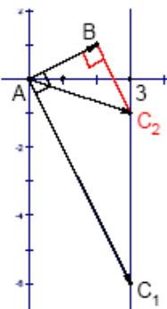

<!-- question-source:start -->
14. 直角坐标系 $xOy$ 中， $i, j$ 分别是与 $x', y'$ 轴正方向同向的单位向量。在直角三角形 $ABC$ 中，若 $\overrightarrow{AB} = 2i + j$ ， $\overrightarrow{AC} = 3i + kj$ ，则 $k$ 的可能值个数是（）A. 1 B. 2 C. 3 D. 4

<!-- question-source:end -->

![[高中/真题/按年份分类/2007/2007年上海高考数学真题_理科_试卷_word解析版_/选择题/题目/answers/Q00025921A1.md]]
