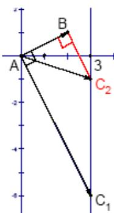

> [!faq]- 2007年上海高考数学真题（理科）试卷（word解析版）解析
>
> > [!success]- **【答案】** B 【
>
> > [!note]- **【分析】**
> > 本题未单列分析。
>
> > [!note]- **【解析】**
> > 解法一： $BC = BA + AC = -2i - j + 3i + kj = i + (k - 1)j$
> > (1) 若A为直角，则 $AB \cdot AC = (2i + j)(3i + kj) = 6 + k = 0 \Rightarrow k = -6$ ;
> > (2) 若B为直角，则 $AB \cdot BC = (2i + j)[i + (k - 1)j] = 1 + k = 0 \Rightarrow k = -1$ ;
> > (3) 若C为直角，则 $AC \cdot BC = (3i + kj)[i + (k - 1)j] = k^2 - k + 3 = 0 \Rightarrow k \in \phi^\circ$ 所以 k 的可能值个数是2，选B
> >
> > 
> >
> > 解法二: 数形结合. 如图, 将 A 放在坐标原点, 则 B 点坐标为 $(2,1)$ , C 点坐标为 $(3,k)$ , 所以 C 点在直线 x=3 上, 由图知, 只可能 A、B 为直角, C 不可能为直角. 所以 k 的可能值个数是 2, 选 B
