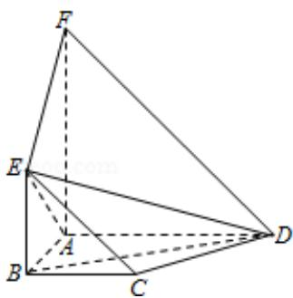

<!-- question-source:start -->
19. (12 分) (2008·四川) 如, 平面 ABEF⊥平面 ABCD, 四边形 ABEF 与 ABCD 都是直角梯形, $\angle BAD = \angle FAB = 90^{\circ}$ , BC $\frac{\parallel}{2} \frac{1}{AD}$ , BE $\frac{\parallel}{2} \frac{1}{AF}$

（Ⅰ）证明：C，D，F，E四点共面；

（Ⅱ）设 AB=BC=BE，求二面角 A-ED-B 的大小.

【考点】与二面角有关的立体几何综合题；棱锥的结构特征.

【专题】计算题；证明题.
<!-- question-source:end -->

![[高中/真题/按年份分类/2008/2008四川高考数学_理科_试题及参考答案_延考区_/三_解答题_共6小题_满分74分_/题目/answers/Q00020851A1.md]]
