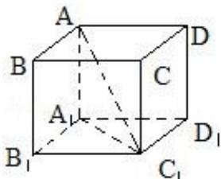

> [!faq]- 2008四川高考数学(理科)试题及参考答案（延考区）解析
>
> > [!success]- **【答案】** 详见解析
>
> > [!note]- **【分析】**
> > 由题意画出图形，求出高，底面边长，然后求出该正四棱柱的体积.
>
> > [!note]- **【解析】**
> > 【分析】由题意画出图形，求出高，底面边长，然后求出该正四棱柱的体积.
> >
> > 【解答】解：如图可知：∵ $AC_{1}=\sqrt{6}$ ， $\cos\angle AC_{1}A_{1}=\frac{\sqrt{3}}{3}$
> >
> > 
> >
> > $\therefore \mathrm{A}_{1} \mathrm{C}_{1} = \sqrt{2}, \mathrm{AA}_{1} = 2 \therefore$ 正四棱柱的体积等于 $\mathrm{A}_{1} \mathrm{B}_{1}^{2} \cdot \mathrm{AA}_{1} = 2$
> >
> > 故答案为：2
> >
> > 【点评】此题重点考查线面角, 解直角三角形, 以及求正四面题的体积; 考查数形结合, 重视在立体几何中解直角三角形, 熟记有关公式.
