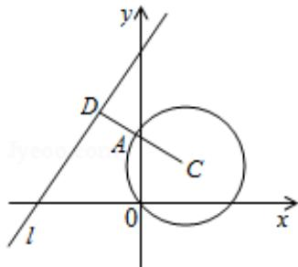

> [!faq]- 2008四川高考数学(理科)试题及参考答案（延考区）解析
>
> > [!success]- **【答案】** $\sqrt{2}$
>
> > [!note]- **【分析】**
> > 如图过点 C 作出 CD 与直线 l 垂直，垂足为 D，与圆 C 交于点 A，则 AD 为所求；求 AD 的方法是：由圆的方程找出圆心坐标与圆的半径，然后利用点到直线的距离公式求出圆心到直线 l 的距离 d，利用 d 减去圆的半径 r 即为圆上的点到直线 l 的距离的最小值.
>
> > [!note]- **【解析】**
> > 解：如图可知：过圆心作直线1： $x - y + 4 = 0$ 的垂线，则AD长即为所求；
> >
> > ∵圆 C: $(x-1)^{2}+(y-1)^{2}=2$ 的圆心为 C $(1,1)$ ，半径为 $\sqrt{2}$ ,
> >
> > 点C到直线l： $x - y + 4 = 0$ 的距离为 $\mathrm{d} = \frac{|1 - 1 + 4|}{\sqrt{2}} = 2\sqrt{2},$
> >
> > $$
> > \therefore \mathrm{AD} = \mathrm{CD} - \mathrm{AC} = 2 \sqrt {2} - \sqrt {2} = \sqrt {2},
> > $$
> >
> > 故 C 上各点到 1 的距离的最小值为 $\sqrt{2}$ .
> >
> > 故答案为： $\sqrt{2}$
> >
> > 
> >
> > 【点评】此题重点考查圆的标准方程和点到直线的距离. 本题的突破点是数形结合, 使用点 C 到直线 l 的距离距离公式.
