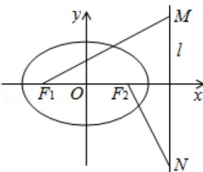

<!-- question-source:start -->
21.（12分）(2008·四川)设椭圆 $\frac{x^2}{a^2} +\frac{y^2}{b^2} = 1$ ，（ $\{\mathrm{a} > \mathrm{b} > 0\}$ ）的左右焦点分别为 $\mathrm{F_1,F_2}$ ，离心率 $e = \frac{\sqrt{2}}{2}$ ，右准线为1，M，N是l上的两个动点， $\overrightarrow{\mathrm{F}_1\mathrm{M}}\cdot \overrightarrow{\mathrm{F}_2\mathrm{N}} = 0$

（1）若 $|\overrightarrow{\mathrm{F}_1\mathrm{M}}| = |\overrightarrow{\mathrm{F}_2\mathrm{N}}| = 2\sqrt{5}$ ，求a，b的值；

（Ⅱ）证明：当 $|MN|$ 取最小值时， $\overrightarrow{F_{1}M}+\overrightarrow{F_{2}N}$ 与 $\overrightarrow{F_{1}F_{2}}$ 共线.

【考点】椭圆的应用.

【专题】计算题；压轴题.

【
<!-- question-source:end -->

![[高中/真题/按年份分类/2008/2008四川高考数学_理科_试题及参考答案_延考区_/解答题/题目/answers/Q00021772A1.md]]
