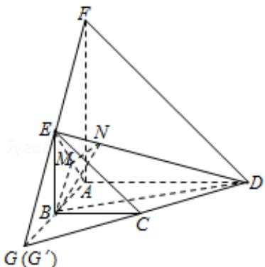

> [!faq]- 2008四川高考数学(理科)试题及参考答案（延考区）解析
>
> > [!success]- **【答案】** 详见解析
>
> > [!note]- **【分析】**
> > （Ⅰ）延长DC交AB的延长线于点G，延长FE交AB的延长线于 $G'$ ，根据比例关系可证得G与 $G'$ 重合，准确推理，得到直线CD、EF相交于点G，即C，D，F，E四点共面.
>
> > [!note]- **【解析】**
> > 分析】（Ⅰ）延长DC交AB的延长线于点G，延长FE交AB的延长线于 $G'$ ，根据比例关系可证得G与 $G'$ 重合，准确推理，得到直线CD、EF相交于点G，即C，D，F，E四点共面.
> >
> > （Ⅱ）取 AE 中点 M，作 MN⊥DE，垂足为 N，连接 BN，由三垂线定理知 BN⊥ED，根据二面角平面角的定义可知 $\angle BMN$ 为二面角 A-ED-B 的平面角，在三角形 BMN 中求出此角即可.
> >
> > 【
> > 解答】解：（I）延长DC交AB的延长线于点G，由BC $\frac{1}{2}\mathrm{AD}$ 得 $\frac{\mathrm{GB}}{\mathrm{GA}} = \frac{\mathrm{GC}}{\mathrm{GD}} = \frac{\mathrm{BC}}{\mathrm{AD}} = \frac{1}{2}$
> >
> > 延长 FE 交 AB 的延长线于 G'
> >
> > 同理可得 $\frac{G^{\prime}E}{G^{\prime}F} = \frac{G^{\prime}B}{G^{\prime}A} = \frac{BE}{AF} = \frac{1}{2}$
> >
> > 故 $\frac{G^{\prime}B}{G^{\prime}A} = \frac{GB}{GA}$ ，即 $G$ 与 $G^{\prime}$ 重合
> >
> > 因此直线 CD、EF 相交于点 G，即 C，D，F，E 四点共面.
> >
> > （Ⅱ）设 AB=1，则 BC=BE=1，AD=2
> >
> > 取 AE 中点 M，则 BM⊥AE，又由已知得，AD⊥平面 ABEF
> >
> > 故 AD⊥BM，BM 与平面 ADE 内两相交直线 AD、AE 都垂直.
> >
> > 所以BM⊥平面ADE，作MN⊥DE，垂足为N，连接BN
> >
> > 由三垂线定理知 BN⊥ED，∠BMN 为二面角 A-ED-B 的平面角.
> >
> > BM= $\frac{\sqrt{2}}{2}$ ，MN= $\frac{1}{2}\cdot\frac{AD\times AE}{DE}=\frac{\sqrt{3}}{3}$
> >
> > 故 $\tan \angle B M N = \frac{B M}{M N} = \frac{\sqrt{6}}{2}$
> >
> > 所以二面角A-ED-B的大小 $\arctan \frac{\sqrt{6}}{2}$
> >
> > 
> >
> > 【点评】此题重点考查立体几何中四点共面问题和求二面角的问题, 考查空间想象能力, 几何逻辑推理能力, 以及计算能力; 突破: 熟悉几何公理化体系, 准确推理, 注意书写格式是顺利进行求解的关键.
