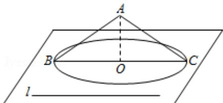

> [!faq]- 2008四川高考数学(理科)试题及参考答案（延考区）解析
>
> > [!success]- **【答案】** B
>
> > [!note]- **【分析】**
> > 利用圆锥的母线与底面所成的交角不变画图，即可得到结果.
>
> > [!note]- **【解析】**
> > 分析】利用圆锥的母线与底面所成的交角不变画图，即可得到结果.
> >
> > 【
> > 解答】解：如图，和 $\alpha$ 成 $30^{\circ}$ 角的直线一定是以A为顶点的圆锥的母线所在直线，当 $\angle ABC = \angle ACB = 30^{\circ}$ ，直线AC，AB都满足条件故选B.
> >
> > 
> >
> > 【点评】此题重点考查线线角，线面角的关系，以及空间想象能力，图形的对称性；数形结合，重视空间想象能力和图形的对称性；
