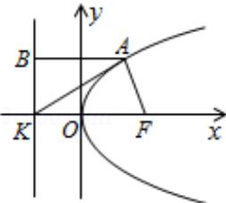

> [!faq]- 2008四川高考数学(理科)试题及参考答案（延考区）解析
>
> > [!success]- **【答案】** B
>
> > [!note]- **【分析】**
> > 根据抛物线的方程可知焦点坐标和准线方程，进而可求得K的坐标，设 $A(x_{0},y_{0})$ ，过A点向准线作垂线AB，则 $B(-2,y_{0})$ ，根据 $|AK|=\sqrt{2}|AF|$ 及 $AF=AB=x_{0}-(-2)=x_{0}+2$ ，进而可求得A点坐标，进而求得△AFK的面积.
> > 【
>
> > [!note]- **【解析】**
> > 分析】根据抛物线的方程可知焦点坐标和准线方程，进而可求得K的坐标，设 $A(x_{0},y_{0})$ ，过A点向准线作垂线AB，则 $B(-2,y_{0})$ ，根据 $|AK|=\sqrt{2}|AF|$ 及 $AF=AB=x_{0}-(-2)=x_{0}+2$ ，进而可求得A点坐标，进而求得△AFK的面积.
> > 【
> > 解答】解：∵抛物线C： $y^{2}=8x$ 的焦点为F（2，0），准线为x=-2
> > ∴K（-2，0）
> > 设A $(x_{0},y_{0})$ ，过A点向准线作垂线AB，则B（-2， $y_{0}$ ）
> > ∴ $|AK|=\sqrt{2}|AF|$ ，又 $AF=AB=x_{0}-(-2)=x_{0}+2$ ∴由 $BK^{2}=AK^{2}-AB^{2}$ 得 $y_{0}^{2}=(x_{0}+2)^{2}$ ，即 $8x_{0}=(x_{0}+2)^{2}$ ，解得A $(2,\pm4)$ ∴△AFK的面积为 $\frac{1}{2}|KF|\cdot|y_{0}|=\frac{1}{2}\times4\times4=8$
> >
> > 故选 B.
> >
> > 
> >
> > 【点评】本题抛物线的性质, 由题意准确画出图象, 利用离心率转化位置, 在 $\triangle$ ABK 中集中条件求出 $x_0$ 是关键;
> >
> > ##
