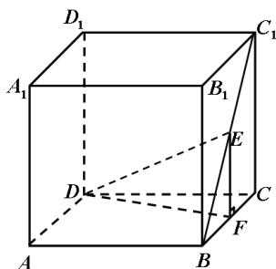

> [!faq]- 2008年上海高考数学真题（文科）试卷（word解析版）解析
>
> > [!success]- **【答案】** (本题满分
>
> > [!note]- **【分析】**
> > 本题解析推导如下：
>
> > [!note]- **【解析】**
> > [解] 过 $E$ 作 $EF \perp BC$ ，交 $BC$ 于 $F$ ，连接 $DF$ . $\because EF \perp$ 平面ABCD，
> >
> > $\therefore \angle EDF$ 是直线 $DE$ 与平面 $ABCD$ 所成的角. ……4分由题意，得 $EF = \frac{1}{2} CC_1 = 1$ . $\because CF = \frac{1}{2} CB = 1, \therefore DF = \sqrt{5}$ . ……8分
> >
> > 
> >
> > ∵ $EF \perp DF$ ，∴ $\tan \angle EDF = \frac{EF}{DF} = \frac{\sqrt{5}}{5}$ . ..... 10 分
> >
> > 故直线 $DE$ 与平面ABCD所成角的大小是 $\arctan \frac{\sqrt{5}}{5}$ ......12分
