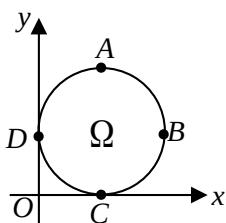

> [!faq]- 2008年上海高考数学真题（文科）试卷（word解析版）解析
>
> > [!success]- **【答案】** $D$
>
> > [!note]- **【分析】**
> > 本题未单列分析。
>
> > [!note]- **【解析】**
> > 由题意知，若 P 优于 $P'$ ，则 P 在 $P'$ 的左上方，
> > ∴当Q在DA上时,左上的点不在圆上,
> > ∴不存在其它优于Q的点,
> > ∴Q 组成的集合是劣弧 DA.
> >
> > 
> >
> > ##
