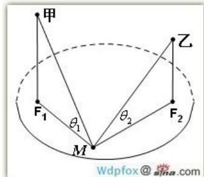

> [!faq]- 2008年上海高考数学真题（理科）试卷（word解析版）解析
>
> > [!success]- **【答案】** $h_{1}\cdot\cot\theta_{1}+h_{2}\cdot\cot\theta_{2}\leq2a$ 【
>
> > [!note]- **【分析】**
> > 本题未单列分析。
>
> > [!note]- **【解析】**
> > 依题意， $\left|MF_{1}\right|+\left|MF_{2}\right|\leq2a$
> >
> > 
> >
> > $$
> > \Rightarrow h _ {1} \cdot \cot \theta_ {1} + h _ {2} \cdot \cot \theta_ {2} \leq 2 a;
> > $$
