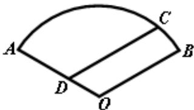

<!-- question-source:start -->
16. (本题满分 12 分)

如图, 在棱长为2的正方体 $ABCD - A_1B_1C_1D_1$ 中, $E$ 是 $BC_{1}$ 的中点. 求直线 $DE$ 与平面 $ABCD$ 所成角的大小 (结果用反三角函数值表示).

[解]

<table><tr><td>得分</td><td>评卷人</td></tr><tr><td></td><td></td></tr></table>

## 17. (本题满分 13 分)

如图，某住宅小区的平面图呈圆心角为 $120^{\circ}$ 的扇形 $AOB$ 。小区的两个出入口设置在点 $A$ 及点 $C$ 处，且小区里有一条平行于 $BO$ 的小路 $CD$ 。已知某人从 $C$ 沿 $CD$ 走到 $D$ 用了 10 分钟，从 $D$ 沿 $DA$ 走到 $A$ 用了 6 分钟。若此人步行的速度为每分钟 50 米，求该扇形的半径 $OA$ 的长（精确到 1 米）。

[解]

<table><tr><td>得分</td><td>评卷人</td></tr><tr><td></td><td></td></tr></table>
<!-- question-source:end -->

![[高中/真题/按年份分类/2008/2008年上海高考数学真题_理科_试卷_word解析版_/解答题/题目/answers/Q00025967A1.md]]
