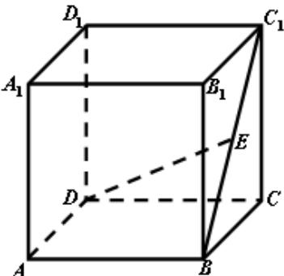

<!-- question-source:start -->
16. (本题满分 12 分)

如图, 在棱长为2的正方体 $ABCD - A_1B_1C_1D_1$ 中, $E$ 是 $BC_{1}$ 的中点. 求直线 $DE$ 与平面 $ABCD$ 所成角的大小 (结果用反三角函数值表示).

[解]

<table><tr><td>得分</td><td>评卷人</td></tr><tr><td></td><td></td></tr></table>
<!-- question-source:end -->

![[高中/真题/按年份分类/2008/2008年上海高考数学真题_理科_试卷_word解析版_/解答题/题目/answers/Q00027743A1.md]]
