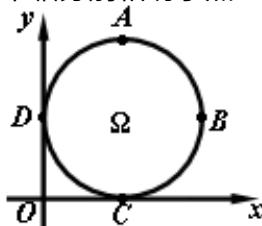

<!-- question-source:start -->
15. 如图，在平面直角坐标系中， $\Omega$ 是一个与 $x$ 轴的正半轴、 $y$ 轴的正半轴分别相切于点

C、D的定圆所围成的区域（含边界），A、B、C、D是该圆的四等分点. 若点 $P(x, y)$ 、点 $P'(x', y')$ 满足 $x \leq x'$ 且 $y \geq y'$ ，则称 $P$ 优于 $P'$ . 如果 $\Omega$ 中的点 $Q$ 满足：不存在 $\Omega$ 中的其它点优于 $Q$ ，那么所有这样的点 $Q$ 组成的集合是劣弧 [答]（）(A) $\widehat{AB}$ (B) . $\widehat{BC}$ . (D) . $\widehat{CD}$ $\widehat{DA}$

##
三. 解答题（本大题满分 90 分）本大题共有 6 题，
<!-- question-source:end -->

![[高中/真题/按年份分类/2008/2008年上海高考数学真题_理科_试卷_word解析版_/选择题/题目/answers/Q00029836A1.md]]
