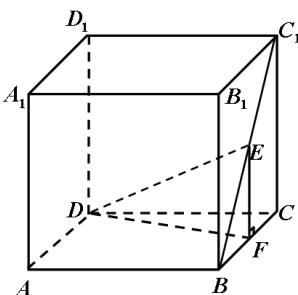

> [!faq]- 2008年上海高考数学真题（理科）试卷（word解析版）解析
>
> > [!success]- **【答案】** [解] 过 E 作 $EF \perp BC$ ，交 BC 于 F，连接 DF
>
> > [!note]- **【分析】**
> > 本题解析推导如下：
>
> > [!note]- **【解析】**
> > [解] 过 E 作 $EF \perp BC$ ，交 BC 于 F，连接 DF.
> > ∵ EF ⊥ 平面 ABCD，
> > ∴ $\angle EDF$ 是直线 DE 与平面 ABCD 所成的角. ..... 4 分
> > 由题意，得 $EF = \frac{1}{2} CC_{1} = 1$ .
> > ∵ $CF = \frac{1}{2} CB = 1, \therefore DF = \sqrt{5}.$ ..... 8 分
> > ∵ $EF \perp DF$ , ∴ $\tan \angle EDF = \frac{EF}{DF} = \frac{\sqrt{5}}{5}.$ .....
> >
> > 
> >
> > 故直线 $DE$ 与平面ABCD所成角的大小是 $\arctan \frac{\sqrt{5}}{5}$
> >
> > 17. [解法一] 设该扇形的半径为 $r$ 米. 连接 $CO$ . …… 2 分
> >
> > ……12分
> >
> > 
> >
> > 由题意，得
> >
> > $CD = 500$ （米）， $DA = 300$ （米）， $\angle CDO = 60^{\circ}$ . ....4分
> >
> > 在 $\triangle CDO$ 中， $CD^{2}+OD^{2}-2\cdot CD\cdot OD\cdot\cos60^{\circ}=OC^{2}$ ，……6分
> >
> > 即 $500^{2} + (r - 300)^{2} - 2 \times 500 \times (r - 300) \times \frac{1}{2} = r^{2}$ ，……9分
> >
> > 解得 $r = \frac{4900}{11} \approx 445$ （米）
> >
> > 答：该扇形的半径 $OA$ 的长约为445米. ……13分
> >
> > [解法二] 连接 $AC$ ，作 $OH \perp AC$ ，交 $AC$ 于 $H$ 。……2分
> >
> > 由题意，得 $CD = 500$ （米）， $AD = 300$ （米）， $\angle CDA = 120^{\circ}$ 。……4分
> >
> > 在 $\triangle ACD$ 中， $AC^{2}=CD^{2}+AD^{2}-2\cdot CD\cdot AD\cdot\cos120^{\circ}$
> >
> > $$
> > = 5 0 0 ^ {2} + 3 0 0 ^ {2} + 2 \times 5 0 0 \times 3 0 0 \times \frac {1}{2} = 7 0 0 ^ {2},
> > $$
> >
> > 
> >
> > ∴ AC = 700 （米），……6分
> >
> > $$
> > \cos \angle C A D = \frac {A C ^ {2} + A D ^ {2} - C D ^ {2}}{2 \cdot A C \cdot A D} = \frac {1 1}{1 4}.
> > $$
> >
> > 在直角 $\triangle HAO$ 中， $AH=350$ （米）， $\cos\angle HAO=\frac{11}{14}$ ，
> >
> > $\therefore OA = \frac{AH}{\cos\angle HAO} = \frac{4900}{11}\approx 445$ （米）.
> >
> > 答：该扇形的半径 $OA$ 的长约为445米. ……13分
