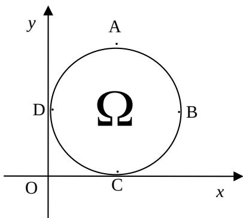

> [!faq]- 2008年上海高考数学真题（理科）试卷（word解析版）解析
>
> > [!success]- **【答案】** $D$
>
> > [!note]- **【分析】**
> > 本题未单列分析。
>
> > [!note]- **【解析】**
> > 依题意，在点 Q 组成的集合中任取一点，过该点分别作平行于两坐标轴的直线，构成的左上方区域（权且称为“第二象限”）与点 Q 组成的集合无公共元素，这样点 Q 组成的集合才为所求. 检验得：D．DA
> >
> > 
