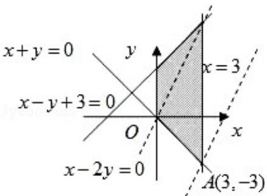

> [!faq]- 2008年全国统一高考数学试卷（文科）（全国卷ⅰ）（含解析版）解析
>
> > [!success]- **【答案】** 详见解析
>
> > [!note]- **【分析】**
> > 首先作出可行域，再作出直线 $l_{0}: y=2x$ ，将 $l_{0}$ 平移与可行域有公共点，直线
>
> > [!note]- **【解析】**
> > 分析】首先作出可行域，再作出直线 $l_{0}: y=2x$ ，将 $l_{0}$ 平移与可行域有公共点，直线
> >
> > $y = 2x - z$ 在 $y$ 轴上的截距最小时， $z$ 有最大值，求出此时直线 $y = 2x - z$ 经过的可
> >
> > 行域内的点的坐标，代入 z=2x-y 中即可.
> >
> > 【
> > 解答】解：如图，作出可行域，作出直线 $l_0: y = 2x$ ，将 $l_0$ 平移至过点 $A$ 处时，函数
> >
> > $z=2x-y$ 有最大值 9.
> >
> > 
> >
> > 【点评】本题考查线性规划问题，考查数形结合思想.
