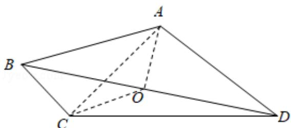

> [!faq]- 2008年全国统一高考数学试卷（文科）（全国卷ⅰ）（含解析版）解析
>
> > [!success]- **【答案】** $\frac{\sqrt{3}}{2}$
>
> > [!note]- **【分析】**
> > 本题考查了立体几何中的折叠问题，及定义法求二面角和点到平面的距
>
> > [!note]- **【解析】**
> > 解：已知如下图所示：
> >
> > 设 $AC \cap BD = O$ ，则 $AO \perp BD$ ， $CO \perp BD$ ，
> >
> > $\therefore \angle AOC$ 即为二面角A-BD-C的平面角
> >
> > $\therefore\angle AOC=120^{\circ}$ ，且AO=1，
> >
> > $$
> > \therefore d = 1 \times \sin 6 0 ^ {\circ} = \frac {\sqrt {3}}{2}
> > $$
> >
> > 
> >
> > 故答案为： $\frac{\sqrt{3}}{2}$
> >
> > 【点评】根据二面角的大小解三角形,一般先作出二面角的平面角.此题是利用二
> >
> > 面角的平面角的定义作出∠AOC为二面角A-BD-C的平面角，通过解∠AOC
> >
> > 所在的三角形求得 $\angle AOC$ 。其解题过程为：作 $\angle AOC \rightarrow$ 证 $\angle AOC$ 是二面角的平
> >
> > 面角→利用∠AOC解三角形AOC，简记为“作、证、算”。
> >
> > ##
