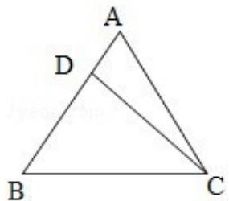

<!-- question-source:start -->
17. （10分）设△ABC的内角A、B、C所对的边长分别为a、b、c，且
acosB=3, bsinA=4.

(Ⅰ) 求边长 a;

(II) 若 $\triangle ABC$ 的面积 $S=10$ , 求 $\triangle ABC$ 的周长 $I$ .

<!-- question-source:end -->

![[高中/真题/按年份分类/2008/2008年全国统一高考数学试卷_文科__全国卷ⅰ__含解析版_/解答题/题目/answers/Q00024629A1.md]]
