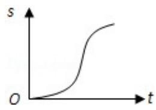
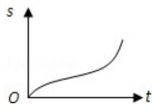
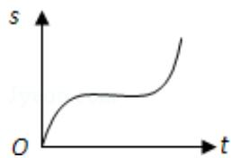
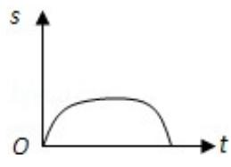

<!-- question-source:start -->
2. (5 分) 汽车经过启动、加速行驶、匀速行驶、减速行驶之后停车, 若把这一过程中汽车的行驶路程 s 看作时间 t 的函数, 其图象可能是 ( )

A.

B.

C.

D.
<!-- question-source:end -->

![[高中/真题/按年份分类/2008/2008年全国统一高考数学试卷_文科__全国卷ⅰ__含解析版_/选择题/题目/answers/Q00024614A1.md]]
