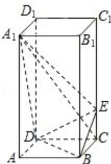

<!-- question-source:start -->
20. （12分）如图，正四棱柱 $ABCD - A_{1}B_{1}C_{1}D_{1}$ 中， $AA_{1} = 2AB = 4$ ，点E在 $CC_{1}$ 上且

$C_{1}E=3EC.$

(Ⅰ) 证明: $A_{1} C \perp$ 平面 BED;

（II）求二面角 $A_{1} - DE - B$ 的大小.

<!-- question-source:end -->

![[高中/真题/按年份分类/2008/2008年全国统一高考数学试卷_文科__全国卷ⅱ__含解析版_/填空题/题目/answers/Q00025137A1.md]]
