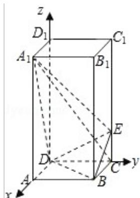
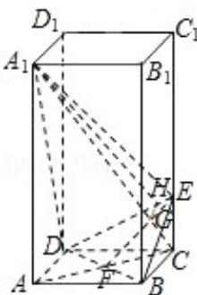

> [!faq]- 2008年全国统一高考数学试卷（文科）（全国卷ⅱ）（含解析版）解析
>
> > [!success]- **【答案】** 详见解析
>
> > [!note]- **【分析】**
> > 法一：（Ⅰ）要证 $A_{1}C \perp$ 平面 BED，只需证明 $A_{1}C$ 与平面 BED 内两条相交直
>
> > [!note]- **【解析】**
> > 解：解法一：
> >
> > 依题设知 AB=2，CE=1。
> >
> > （Ⅰ）连接 AC 交 BD 于点 F，则 BD⊥AC.
> >
> > 由三垂线定理知， $BD \perp A_{1}C$ 。（3分）
> >
> > 在平面 $A_{1}CA$ 内，连接 EF 交 $A_{1}C$ 于点 G，
> >
> > 由于 $\frac{AA_1}{FC} = \frac{AC}{CE} = 2\sqrt{2}$
> >
> > 故 $Rt\triangle A_{1}AC \sim Rt\triangle FCE$ ， $\angle AA_{1}C = \angle CFE$ ， $\angle CFE$ 与 $\angle FCA_{1}$ 互余.
> >
> > 于是 $A_{1}C \perp EF$ 。 $A_{1}C$ 与平面 BED 内两条相交直线 BD，EF 都垂直，
> >
> > 所以 $A_{1}C \perp$ 平面 BED. (6 分)
> >
> > （II）作 GH⊥DE，垂足为 H，连接 A₁H．由三垂线定理知 A₁H⊥DE，
> >
> > 故 $\angle A_{1}HG$ 是二面角 $A_{1}-DE-B$ 的平面角．（8分）
> >
> > $$
> > \mathrm{EF} = \sqrt {\mathrm{CF} ^ {2} + \mathrm{CE} ^ {2}} = \sqrt {3}, \quad \mathrm{CG} = \frac {\mathrm{CE} \times \mathrm{CF}}{\mathrm{EF}} = \frac {\sqrt {2}}{\sqrt {3}}, \quad \mathrm{EG} = \sqrt {\mathrm{CE} ^ {2} - \mathrm{CG} ^ {2}} = \frac {\sqrt {3}}{3}. \quad \frac {\mathrm{EG}}{\mathrm{EF}} = \frac {1}{3},
> > $$
> >
> > $$
> > \mathrm{GH} = \frac {1}{3} \times \frac {\mathrm{EF} \times \mathrm{FD}}{\mathrm{DE}} = \frac {\sqrt {2}}{\sqrt {1 5}}.
> > $$
> >
> > $$
> > \text { 又 } \mathrm{A} _ {1} \mathrm{C} = \sqrt {\mathrm{AA} _ {1} ^ {2} + \mathrm{AC} ^ {2}} = 2 \sqrt {6}, \mathrm{A} _ {1} \mathrm{G} = \mathrm{A} _ {1} \mathrm{C} - \mathrm{CG} = \frac {5 \sqrt {6}}{3}. \tan \angle \mathrm{A} _ {1} \mathrm{HG} = \frac {\mathrm{A} _ {1} \mathrm{G}}{\mathrm{HG}} = 5 \sqrt {5}.
> > $$
> >
> > 所以二面角 $A_{1}-DE-B$ 的大小为 $\arctan5\sqrt{5}$ . （（12分））
> >
> > 解法二：
> >
> > 以 D 为坐标原点，射线 DA 为 x 轴的正半轴，
> >
> > 建立如图所示直角坐标系 D - xyz.
> >
> > 依题设，B（2，2，0），C（0，2，0），E（0，2，1）， $A_{1}$ （2，0，4）.
> >
> > $\overrightarrow{\mathrm{DE}} = (0, 2, 1), \overrightarrow{\mathrm{DB}} = (2, 2, 0), \overrightarrow{\mathrm{A}_1\mathrm{C}} = (-2, 2, -4), \overrightarrow{\mathrm{DA}_1} = (2, 0, 4).$ （3分）
> > （1）因为 $\overrightarrow{\mathrm{A}_1\mathrm{C}}\cdot \overrightarrow{\mathrm{DB}} = 0$ ， $\overrightarrow{\mathrm{A}_1\mathrm{C}}\cdot \overrightarrow{\mathrm{DE}} = 0,$
> >
> > $$
> > \mathrm{A} _ {1} \mathrm{C} \perp \mathrm{BD}, \quad \mathrm{A} _ {1} \mathrm{C} \perp \mathrm{DE}
> > $$
> >
> > 又 DB∩DE=D,
> >
> > 所以 $A_{1}C \perp$ 平面 DBE. （6 分）
> >
> > （II）设向量 $\vec{n}=(x,y,z)$ 是平面 $DA_{1}E$ 的法向量，则 $n\perp\overrightarrow{DE},n\perp\overrightarrow{DA_{1}}.$
> >
> > 故 $2y+z=0,\quad2x+4z=0.$
> >
> > 令 $y = 1$ ，则 $z = -2, x = 4, \vec{n} = (4, 1, -2)$ . (9分) $\langle \vec{n}, \overrightarrow{A_1C} \rangle$ 等于二面角 $A_1 - DE - B$
> >
> > 的平面角， $\cos < \vec{n}$ ， $\overrightarrow{A_1C} = > \frac{\vec{n} \cdot \overrightarrow{A_1C}}{|\vec{n}| |\overrightarrow{A_1C}|} = \frac{\sqrt{14}}{42}$
> >
> > 所以二面角 $A_{1} - DE - B$ 的大小为 $\arccos \frac{\sqrt{14}}{42}$ （12分）
> >
> > 
> >
> > 
> >
> > 【点评】本题考查直线与平面垂直的判定，二面角的求法，考查空间想象能力，逻
> >
> > 辑思维能力，是中档题.
