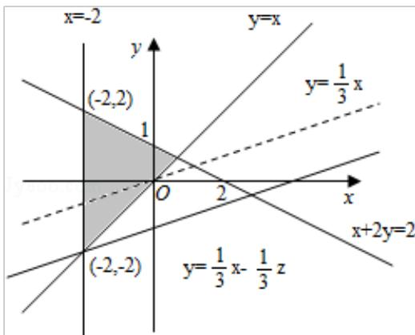

> [!faq]- 2008年全国统一高考数学试卷（文科）（全国卷ⅱ）（含解析版）解析
>
> > [!success]- **【答案】** D
>
> > [!note]- **【分析】**
> > 我们先画出满足约束条件： $\left\{ \begin{array}{l} y \geqslant x \\ x + 2y \leqslant 2 \\ x \geqslant -2 \end{array} \right.$ 的平面区域，求出平面区域的各角点
>
> > [!note]- **【解析】**
> > 解：根据题意，画出可行域与目标函数线如图所示，
> >
> > 由图可知目标函数在点（-2，2）取最小值-8
> >
> > 故选：D.
> >
> > 
> >
> > 【点评】用图解法解决线性规划问题时, 分析题目的已知条件, 找出约束条件和目
> > 标函数是关键, 可先将题目中的量分类、列出表格, 理清头绪, 然后列出不等
> > 式组（方程组）寻求约束条件, 并就题目所述找出目标函数. 然后将可行域各
> > 角点的值一一代入, 最后比较, 即可得到目标函数的最优解.
