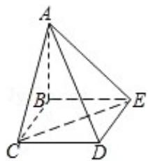

<!-- question-source:start -->
18. (12 分) 四棱锥 A - BCDE 中, 底面 BCDE 为矩形, 侧面 ABC⊥底面 BCDE, BC=2, $CD=\sqrt{2}$ , AB=AC.

（Ⅰ）证明：AD⊥CE；

（II）设 CE 与平面 ABE 所成的角为 $45^{\circ}$ ，求二面角 C-AD-E 的大小.

<!-- question-source:end -->

![[高中/真题/按年份分类/2008/2008年全国统一高考数学试卷_理科__全国卷ⅰ__含解析版_/填空题/题目/answers/Q00024608A1.md]]
