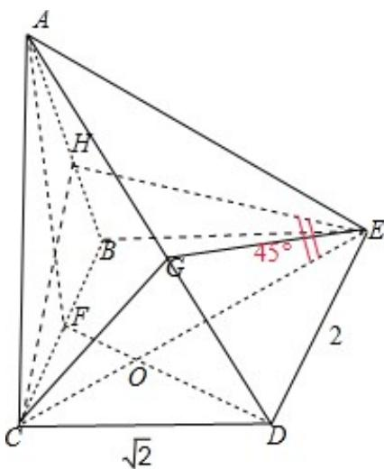

> [!faq]- 2008年全国统一高考数学试卷（理科）（全国卷ⅰ）（含解析版）解析
>
> > [!success]- **【答案】** 详见解析
>
> > [!note]- **【分析】**
> > （1）取 BC 中点 F，证明 CE⊥面 ADF，通过证明线面垂直来达到证明线线垂
>
> > [!note]- **【解析】**
> > 分析】（1）取 BC 中点 F，证明 CE⊥面 ADF，通过证明线面垂直来达到证明线线垂
> >
> > 直的目的.
> >
> > (2) 在面 AED 内过点 E 作 AD 的垂线, 垂足为 G, 由 (1) 知, CE⊥AD, 则 ∠CGE 即为
> >
> > 所求二面角的平面角， $\triangle \mathrm{CGE}$ 中，使用余弦定理求出此角的大小.
> >
> > 【
> > 解答】解：（1）取 BC 中点 F，连接 DF 交 CE 于点 O，
> >
> > ∵AB=AC，∴AF⊥BC.
> >
> > 又面 ABC⊥面 BCDE，∴AF⊥面 BCDE，∴AF⊥CE.
> >
> > 再根据 $\tan\angle CED=\tan\angle FDC=\frac{\sqrt{2}}{2}$ ，可得 $\angle CED=\angle FDC$ .
> >
> > 又 $\angle CDE=90^{\circ}$ ， $\therefore \angle OED+\angle ODE=90^{\circ}$ ，
> >
> > $\therefore \angle DOE = 90^{\circ}$ ，即 $CE \perp DF$ ， $\therefore CE \perp$ 面ADF， $\therefore CE \perp AD.$
> >
> > (2) 在面 ACD 内过 C 点作 AD 的垂线，垂足为 G.
> >
> > ∵CG⊥AD，CE⊥AD，∴AD⊥面 CEG，∴EG⊥AD，
> >
> > 则 $\angle CGE$ 即为所求二面角的平面角.
> >
> > 作 CH⊥AB，H 为垂足.
> >
> > ∵平面 ABC⊥平面 BCDE，矩形 BCDE 中，BE⊥BC，故 BE⊥平面 ABC，CH⊂平面 ABC，
> >
> > 故 BE⊥CH，而 AB∩BE=B，故 CH⊥平面 ABE，
> >
> > $\therefore \angle C E H = 45^{\circ}$ 为CE与平面ABE所成的角.
> >
> > $$
> > \because C E = \sqrt {6}, \therefore C H = E H = \sqrt {3}.
> > $$
> >
> > 直角三角形CBH中，利用勾股定理求得 $\mathrm{BH} = \sqrt{\mathrm{CB}^2 - \mathrm{CH}^2} = \sqrt{4 - 3} = 1$ ，∴AH=AB-
> >
> > BH=AC - 1;
> >
> > 直角三角形 ACH 中，由勾股定理求得 $AC^{2}=CH^{2}+AH^{2}=3+(AC-1)^{2}$ ，∴ AB=AC=2.
> >
> > 由面 ABC⊥面 BCDE，矩形 BCDE 中 CD⊥CB，可得 CD⊥面 ABC，
> >
> > 故 $\triangle ACD$ 为直角三角形， $AD=\sqrt{AC^{2}+CD^{2}}=\sqrt{4+2}=\sqrt{6}$ ，
> >
> > 故 $CG=\frac{AC\cdot CD}{AD}=\frac{2\cdot\sqrt{2}}{\sqrt{6}}=\frac{2\sqrt{3}}{3}$ ， $DG=\sqrt{CD^{2}-CG^{2}}=\frac{\sqrt{6}}{3}$
> >
> > $EG=\sqrt{DE^{2}-DG^{2}}=\frac{\sqrt{30}}{3}$ ，又 $CE=\sqrt{6}$ ，
> >
> > 则 $\cos \angle CGE = \frac{CG^2 + GE^2 - CE^2}{2CG*GE} = -\frac{\sqrt{10}}{10}$
> >
> > $$
> > \therefore \angle C G E = \pi - \arccos \left(\frac {\sqrt {1 0}}{1 0}\right),
> > $$
> >
> > 即二面角 C-AD-E 的大小 $\pi-\arccos\left(\frac{\sqrt{10}}{10}\right)$ .
> >
> > 
> >
> > 【点评】本题主要考查通过证明线面垂直来证明线线垂直的方法，以及求二面角
> >
> > 的大小的方法，属于中档题.
