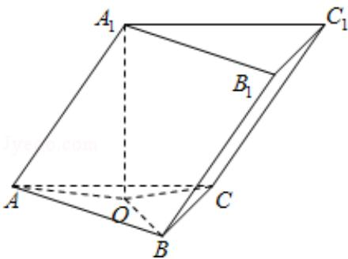
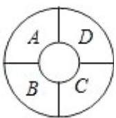

<!-- question-source:start -->
11. (5 分) 已知三棱柱 $ABC - A_{1}B_{1}C_{1}$ 的侧棱与底面边长都相等, $A_{1}$ 在底面 $ABC$ 内的射影为 $\triangle ABC$ 的中心, 则 $AB_{1}$ 与底面 $ABC$ 所成角的正弦值等于 ( )

A. $\frac{1}{3}$ B. $\frac{\sqrt{2}}{3}$ C. $\frac{\sqrt{3}}{3}$ D. $\frac{2}{3}$

<!-- question-source:end -->

![[高中/真题/按年份分类/2008/2008年全国统一高考数学试卷_理科__全国卷ⅰ__含解析版_/选择题/题目/answers/Q00024601A1.md]]
