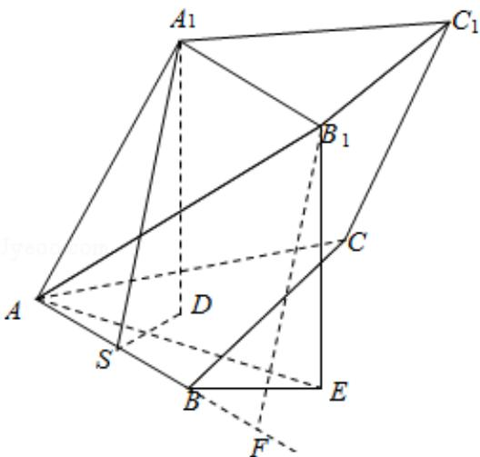
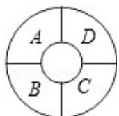

> [!faq]- 2008年全国统一高考数学试卷（理科）（全国卷ⅰ）（含解析版）解析
>
> > [!success]- **【答案】** B
>
> > [!note]- **【分析】**
> > 法一: 由题意可知三棱锥 $A_{1}-ABC$ 为正四面体, 设棱长为 2, 求出 $AB_{1}$ 及三
>
> > [!note]- **【解析】**
> > 分析】法一: 由题意可知三棱锥 $A_{1}-ABC$ 为正四面体, 设棱长为 2, 求出 $AB_{1}$ 及三
> >
> > 棱锥的高，由线面角的定义可求出
> > 答案；
> >
> > 法二：先求出点 $A_{1}$ 到底面的距离 $A_{1}D$ 的长度，即知点 $B_{1}$ 到底面的距离 $B_{1}E$ 的长度
> >
> > 再求出 AE 的长度，在直角三角形 $AEB_{1}$ 中求 $AB_{1}$ 与底面 ABC 所成角的正切，再
> >
> > 由同角三角函数的关系求出其正弦.
> >
> > 【
> > 解答】解：（法一）因为三棱柱 ABC - A₁B₁C₁ 的侧棱与底面边长都相等，A₁ 在底面
> >
> > ABC 内的射影为 $\triangle ABC$ 的中心，设为 D，
> >
> > 所以三棱锥 $A_{1}-ABC$ 为正四面体，设棱长为 2，
> >
> > 则 $\triangle AA_{1}B_{1}$ 是顶角为 $120^{\circ}$ 等腰三角形，
> >
> > 所以 $\mathrm{AB}_1 = 2\times 2\times \sin 60^{\circ} = 2\sqrt{3},\mathrm{A}_1\mathrm{D} = \sqrt{2^2 - (\frac{2}{3}\times\sqrt{3})^2} = \frac{2\sqrt{6}}{3},$
> >
> > 所以 $AB_{1}$ 与底面 ABC 所成角的正弦值为 $\frac{A_{1}D}{AB_{1}}=\frac{\frac{2\sqrt{6}}{3}}{\frac{2\sqrt{3}}{3}}=\frac{\sqrt{2}}{3}$ ;
> >
> > (法二) 由题意不妨令棱长为 2，点 $B_{1}$ 到底面的距离是 $B_{1}E$ ，
> >
> > 如图， $A_{1}$ 在底面 ABC 内的射影为 $\triangle ABC$ 的中心，设为 D，
> >
> > 故 $\mathrm{DA} = \frac{2\sqrt{3}}{3}$
> >
> > 由勾股定理得 $A_{1}D = \sqrt{4 - \frac{4}{3}} = \frac{2\sqrt{6}}{3}$ 故 $B_{1}E = \frac{2\sqrt{6}}{3}$
> >
> > 如图作 $A_{1}S \perp AB$ 于中点 S，过 B1 作 AB 的垂线段，垂足为 F，
> >
> > BF=1, $B_{1}F=A_{1}S=\sqrt{3}$ , AF=3,
> >
> > 在直角三角形 $B_{1}AF$ 中用勾股定理得： $AB_{1}=2\sqrt{3}$
> >
> > 所以 $AB_{1}$ 与底面 ABC 所成角的正弦值 $\sin\angle B_{1}AE=\frac{\frac{2\sqrt{6}}{3}}{\frac{2\sqrt{3}}{3}}=\frac{\sqrt{2}}{3}$ .
> >
> > 故选：B.
> >
> > 
> >
> > 【点评】本题考查了几何体的结构特征及线面角的定义，还有点面距与线面距的转化，考查了转化思想和空间想象能力。
> >
> > 
