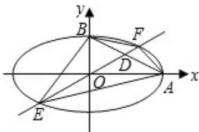

> [!faq]- 2008年全国统一高考数学试卷（理科）（全国卷ⅱ）（含解析版）解析
>
> > [!success]- **【答案】** 详见解析
>
> > [!note]- **【分析】**
> > （1）依题可得椭圆的方程，设直线 AB，EF 的方程分别为
>
> > [!note]- **【解析】**
> > 解：（Ⅰ）依题设得椭圆的方程为 $\frac{x^{2}}{4}+y^{2}=1$ ，
> >
> > 直线 AB，EF 的方程分别为 $x+2y=2$ ， $y=kx$ （k>0）。
> >
> > 如图，设 D $(x_{0}, kx_{0})$ ，E $(x_{1}, kx_{1})$ ，F $(x_{2}, kx_{2})$ ，其中 $x_{1} < x_{2}$ ，
> >
> > 
> >
> > 且 $x_{1}$ ， $x_{2}$ 满足方程 $(1+4k^{2})x^{2}=4$ ，
> >
> > 故 $\mathbf{x}_2 = -\mathbf{x}_1 = \frac{2}{\sqrt{1 + 4k^2}}$ ①
> >
> > 由 $\overrightarrow{ED} = 6\overrightarrow{DF}$ 知 $x_0 - x_1 = 6(x_2 - x_0)$ ，得 $x_0 = \frac{1}{7}(6x_2 + x_1) = \frac{5}{7} x_2 = \frac{10}{7\sqrt{1 + 4k^2}}$
> >
> > 由 D 在 AB 上知 $x_{0}+2kx_{0}=2$ ，得 $x_{0}=\frac{2}{1+2k}$ .
> >
> > 所以 $\frac{2}{1 + 2k} = \frac{10}{7\sqrt{1 + 4k^2}}$
> >
> > 化简得 $24k^{2}-25k+6=0$ ,
> >
> > 解得 $k=\frac{2}{3}$ 或 $k=\frac{3}{8}$ .
> >
> > （Ⅱ）由题设， $|BO|=1,\quad|AO|=2$ ．由（Ⅰ）知， $E(x_{1},kx_{1})$ ， $F(x_{2},kx_{2})$ ，
> > 不妨设 $y_{1}=kx_{1}$ ， $y_{2}=kx_{2}$ ，由①得 $x_{2}>0$ ，根据 E 与 F 关于原点对称可知 $y_{2}=-y_{1}>0$ ，
> >
> > 故四边形 AEBF 的面积为 $S=S_{\triangle OBE}+S_{\triangle OBF}+S_{\triangle OAE}+S_{\triangle OAF}$
> >
> > $$
> > = \frac {1}{2} | O B | \cdot (- x _ {1}) + \frac {1}{2} | O B | \cdot x _ {2} + \frac {1}{2} | O A | \cdot y _ {2} + \frac {1}{2} | O A | \cdot (- y _ {1})
> > $$
> >
> > $$
> > = \frac {1}{2} | O B | (x _ {2} - x _ {1}) + \frac {1}{2} | O A | (y _ {2} - y _ {1})
> > $$
> >
> > $$
> > = x _ {2} + 2 y _ {2}
> > $$
> >
> > $$
> > = \sqrt {\left(x _ {2} + 2 y _ {2}\right) ^ {2}} = \sqrt {x _ {2} ^ {2} + 4 y _ {2} ^ {2} + 4 x _ {2} y _ {2}} \leqslant \sqrt {2 \left(x _ {2} ^ {2} + 4 y _ {2} ^ {2}\right)} = 2 \sqrt {2},
> > $$
> >
> > 当 $x_{2}=2y_{2}$ 时，上式取等号．所以 s 的最大值为 $2\sqrt{2}$ .
> >
> > 【点评】本题主要考查了直线与圆锥曲线的综合问题. 直线与圆锥曲线的综合问
> >
> > 题是支撑圆锥曲线知识体系的重点内容，问题的解决具有入口宽、方法灵活
> >
> > 多样等，而不同的解题途径其运算量繁简差别很大。
