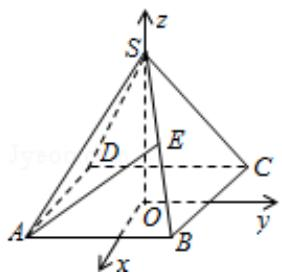

> [!faq]- 2008年全国统一高考数学试卷（理科）（全国卷ⅱ）（含解析版）解析
>
> > [!success]- **【答案】** C
>
> > [!note]- **【分析】**
> > 由于是正方体，又是求角问题，所以易选用向量量，所以建立如图所示坐
>
> > [!note]- **【解析】**
> > 解：建立如图所示坐标系，
> >
> > 令正四棱锥的棱长为 2，则 A（1，-1，0），D（-1，-1，0），
> >
> > $$
> > s (0, 0, \sqrt {2}), E (\frac {1}{2}, \frac {1}{2}, \frac {\sqrt {2}}{2}),
> > $$
> >
> > $$
> > \overrightarrow {A E} = \left(- \frac {1}{2}, \frac {3}{2}, \frac {\sqrt {2}}{2}\right),
> > $$
> >
> > $$
> > \overrightarrow {\mathrm{SD}} = (- 1, - 1, - \sqrt {2})
> > $$
> >
> > $$
> > \therefore \cos <   \overrightarrow {A E}, \overrightarrow {S D} > = \frac {\sqrt {3}}{3}
> > $$
> >
> > 故选：C.
> >
> > 
> >
> > 【点评】本题主要考查多面体的结构特征和空间角的求法, 同时, 还考查了转化思
> >
> > 想和运算能力，属中档题.
