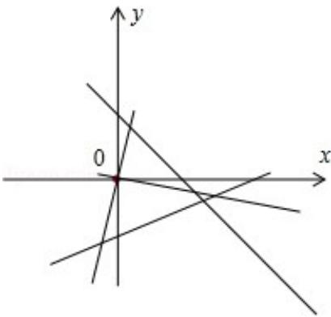

> [!faq]- 2008年全国统一高考数学试卷（理科）（全国卷ⅱ）（含解析版）解析
>
> > [!success]- **【答案】** A
>
> > [!note]- **【分析】**
> > 利用原点在等腰三角形的底边上，可设底边方程 y=kx，用到角公式，再借
>
> > [!note]- **【解析】**
> > 分析】利用原点在等腰三角形的底边上，可设底边方程 y=kx，用到角公式，再借
> >
> > 助草图，选项判定结果即可.
> >
> > 【
> > 解答】解： $l_{1}$ ： $x+y-2=0,\quad k_{1}=-1,\quad l_{2}$ ： $x-7y-4=0,\quad k_{2}=\frac{1}{7}$ ，设底边为 $l_{3}$ ：y=kx
> >
> > 由题意， $l_{3}$ 到 $l_{1}$ 所成的角等于 $l_{2}$ 到 $l_{3}$ 所成的角于是有 $\frac{k_{1}-k}{1+k_{1}k}=\frac{k-k_{2}}{1+k_{2}k}\Rightarrow\frac{k+1}{k-1}=\frac{7k-1}{7+k}$ ，解得k=3或 $k=-\frac{1}{3}$ ，
> >
> > 因为原点在等腰三角形的底边上，所以 k=3.
> >
> > $k=-\frac{1}{3}$ ，原点不在等腰三角形的底边上（舍去），
> >
> > 故选：A.
> >
> > 
> >
> > 【点评】两直线成角的概念及公式；本题是由教材的一个例题改编而成。（人教版P49例7）解题过程值得学习.
