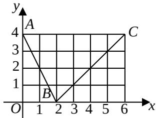

<!-- question-source:start -->
12. 如图, 函数 $f(x)$ 的图象是折线段 $ABC$ , 其中 $A, B, C$ 的坐标分别为 $(0, 4)(2, 0)(6, 4)$ ,

则 $f(f(0)) =$

$\lim_{\Delta x \to 0} \frac{f(1 + \Delta x) - f(1)}{\Delta x} =$ \_\_\_\_。（用数字作答）

<!-- question-source:end -->

![[高中/真题/按年份分类/2008/2008年北京高考理科数学试题及答案/填空题/题目/answers/Q00023128A1.md]]
