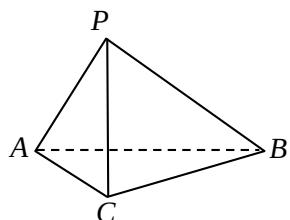

<!-- question-source:start -->
16. （本小题共 14 分）

如图, 在三棱锥 $P - ABC$ 中, $AC = BC = 2'$ , $\angle ACB = 90^\circ$ , $AP = BP = AB'$ , $PC \perp AC$ .

（1）求证： $PC\perp AB$

（Ⅱ）求二面角 $B - AP - C$ 的大小；

（III）求点 C 到平面 APB 的距离.
<!-- question-source:end -->

![[高中/真题/按年份分类/2008/2008年北京高考理科数学试题及答案/解答题/题目/answers/Q00023132A1.md]]
