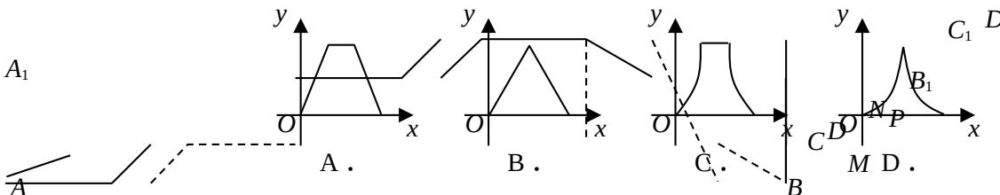

<!-- question-source:start -->
5. 若实数 $x, y$ 满足 $\left\{ \begin{array}{l} x - y + 1 \geq 0 \\ x + y \geq 0, \\ x \leq 0, \end{array} \right.$ 则 $z = 3^{x + 2y}$ 的最小值是（）A.0 B.1 C. $\sqrt{3}$ D.9

<!-- question-source:end -->

![[高中/真题/按年份分类/2008/2008年北京高考理科数学试题及答案/选择题/题目/answers/Q00023121A1.md]]
