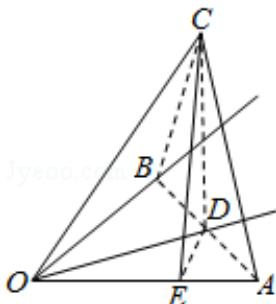

> [!faq]- 2008年四川省高考数学试卷(文科)延考卷答案与解析解析
>
> > [!success]- **【答案】** 详见解析
>
> > [!note]- **【分析】**
> > 由对称性点 C 在平面 AOB 内的射影 D 必在 $\angle AOB$ 的平分线上，作 DE⊥OA 于 E，根据线面所成角的定义可知 $\angle COD$ 为直线 OC 与平面 AOB 所成角，在三角形 COD 中求解此角即可.
>
> > [!note]- **【解析】**
> > 分析】由对称性点 C 在平面 AOB 内的射影 D 必在 $\angle AOB$ 的平分线上，作 DE⊥OA 于 E，根据线面所成角的定义可知 $\angle COD$ 为直线 OC 与平面 AOB 所成角，在三角形 COD 中求解此角即可.
> >
> > 【
> > 解答】解：由对称性点 C 在平面 AOB 内的射影 D 必在 $\angle AOB$ 的平分线上
> >
> > 作 DE⊥OA 于 E，连接 CE 则由三垂线定理 CE⊥OE，
> >
> > 设 $\mathrm{DE} = 1\Rightarrow \mathrm{OE} = 1$ ， $\mathrm{OD} = \sqrt{2}$ ，又 $\angle \mathrm{COE} = 60^{\circ}$ ， $\mathrm{CE}\bot \mathrm{OE}\Rightarrow \mathrm{OC} = 2$
> >
> > 所以 $\mathrm{CD} = \sqrt{\mathrm{OC}^2 - \mathrm{OD}^2} = \sqrt{2}$
> >
> > 因此直线 OC 与平面 AOB 所成角的正弦值 $\sin\angle COD=\frac{\sqrt{2}}{2}$ .
> >
> > 
> >
> > 【点评】本题主要考查了直线与平面所成角，以及三垂线定理，考查空间想象能力、运算能力和推理论证能力，属于基础题.
> >
> > ##
