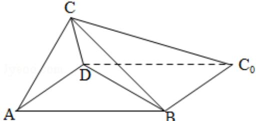

<!-- question-source:start -->
19. (12 分) (2008·四川) 如图, 一张平行四边形的硬纸片 $\mathrm{ABC}_{0} \mathrm{~D}$ 中, $\mathrm{AD} = \mathrm{BD} = 1$ , $\mathrm{AB} = \sqrt{2}$ . 沿它的对角线 BD 把 $\triangle \mathrm{BDC}_{0}$ 折起, 使点 $\mathrm{C}_{0}$ 到达平面 $\mathrm{ABC}_{0} \mathrm{~D}$ 外点 C 的位置.

（Ⅰ）证明：平面 $ABC_{0}D \perp$ 平面 $CBC_{0}$ ;

（Ⅱ）如果 $\triangle ABC$ 为等腰三角形，求二面角A-BD-C的大小.

【考点】与二面角有关的立体几何综合题；平面与平面垂直的判定.

【专题】计算题.

【
<!-- question-source:end -->

![[高中/真题/按年份分类/2008/2008年四川省高考数学试卷_文科_延考卷答案与解析/解答题/题目/answers/Q00022171A1.md]]
