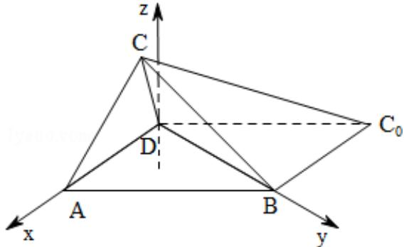
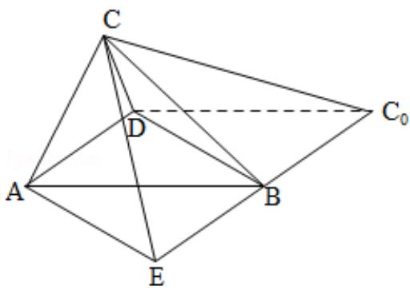

> [!faq]- 2008年四川省高考数学试卷(文科)延考卷答案与解析解析
>
> > [!success]- **【答案】** 详见解析
>
> > [!note]- **【分析】**
> > （Ⅰ）要证面面垂直，只要证线面垂直，要证线面垂直，只要证线线垂直，由题意易得DB⊥BC，又DB⊥BC0，则题目可证.
>
> > [!note]- **【解析】**
> > 分析】（Ⅰ）要证面面垂直，只要证线面垂直，要证线面垂直，只要证线线垂直，由题意易得DB⊥BC，又DB⊥BC0，则题目可证.
> >
> > （Ⅱ）解法一：由 DB⊥BC, AD⊥BD, 故只要过 B 做 BE∥AD, 则角 ∠CBE 为二面角 A-BD-C 的平面角, 构造三角形求角即可.
> >
> > 解法二: 根据题意, 建立空间坐标系, 利用空间向量求解. 由于 DA⊥BD, BC⊥BD, 所以 $\overrightarrow{DA}$ 与 $\overrightarrow{BC}$ 夹角的大小等于二面角 A-BD-C 的大小. 由夹角公式求 $\overrightarrow{DA}$ 与 $\overrightarrow{BC}$ 的夹角的余弦, 从而确定角的大小.
> >
> > 【
> > 解答】解：（I）证明：因为 $\mathrm{AD} = \mathrm{BC}_0 = \mathrm{BD} = 1$ ， $\mathrm{AB} = \mathrm{C}_0\mathrm{D} = \sqrt{2}$ ，所以 $\angle \mathrm{DBC}_0 = 90^\circ$ ， $\angle \mathrm{ADB} = 90^\circ$
> >
> > 因为折叠过程中， $\angle DBC = \angle DBC_{0} = 90^{\circ}$ ，所以 $DB \perp BC$ ，又 $DB \perp BC_{0}$ ，
> >
> > 故 DB⊥平面 CBC $_{0}$ .
> >
> > 又 DBC 平面 ABC $_{0}$ D,
> >
> > 所以平面 $ABC_{0}D \perp$ 平面 $CBC_{0}$ .
> >
> > （Ⅱ）解法一：如图，延长 $C_{0}B$ 到E，使 $BE=C_{0}B$ ，连接AE，CE.
> >
> > 因为 AD 平行等于 BE，BE=1，DB=1， $\angle DBE=90^{\circ}$ ，
> >
> > 所以 AEBD 为正方形，AE=1.
> >
> > 由于 AE，DB 都与平面 $CBC_{0}$ 垂直，
> >
> > 所以 AE⊥CE，可知 AC>1.
> >
> > 因此只有 $AC = AB = \sqrt{2}$ 时， $\triangle ABC$ 为等腰三角形.
> >
> > 在 Rt△AEC 中， $CE=\sqrt{AC^{2}-AE^{2}}=1$ ，又 BC=1，
> >
> > 所以 $\triangle CEB$ 为等边三角形， $\angle CBE=60^{\circ}$ .
> >
> > 由（Ⅰ）可知，CB⊥BD，EB⊥BD，
> >
> > 所以 $\angle CBE$ 为二面角A-BD-C的平面角，
> >
> > 即二面角 A - BD - C 的大小为 $60^{\circ}$ .
> >
> > 解法二：以D为坐标原点，射线DA，DB分别为 $\mathbf{x}$ 轴正半轴和y轴正半轴，
> >
> > 建立如图的空间直角坐标系 D - xyz，
> >
> > 则A（1，0，0），B（0，1，0），D（0，0，0）
> >
> > 由（Ⅰ）可设点 C 的坐标为 $(x, 1, z)$ ，其中 z > 0，则有 $x^{2} + z^{2} = 1$ 。①
> >
> > 因为 $\triangle ABC$ 为等腰三角形，所以AC=1或 $AC=\sqrt{2}$ .
> >
> > 若 AC=1，则有 $(x-1)^{2}+1+z^{2}=1$ .
> >
> > 由此得 x=1，z=0，不合题意.
> >
> > 若 $AC = \sqrt{2}$ ，则有 $(x - 1)^2 + 1 + z^2 = 2$ 。②
> >
> > 联立①和②得 $x = \frac{1}{2}$ ， $z = \frac{\sqrt{3}}{2}$ 。故点 C 的坐标为 $\left(\frac{1}{2}, 1, \frac{\sqrt{3}}{2}\right)$
> >
> > 由于 DA⊥BD，BC⊥BD，所以 $\overrightarrow{DA}$ 与 $\overrightarrow{BC}$ 夹角的大小等于二面角 A-BD-C 的大小.
> >
> > 又 $\overrightarrow{\mathrm{DA}} = (1, 0, 0)$ ， $\overrightarrow{\mathrm{BC}} = (\frac{1}{2}, 0, \frac{\sqrt{3}}{2})$ ， $\cos < \overrightarrow{\mathrm{DA}}$ ， $\overrightarrow{\mathrm{BC}} > = \frac{\overrightarrow{\mathrm{DA}} \cdot \overrightarrow{\mathrm{BC}}}{|\overrightarrow{\mathrm{DA}}||\overrightarrow{\mathrm{BC}}|} = \frac{1}{2}$ .
> >
> > 所以 $\langle \overrightarrow{\mathrm{DA}},\overrightarrow{\mathrm{BC}}\rangle = 60^{\circ}$
> >
> > 即二面角 A - BD - C 的大小为 $60^{\circ}$ .
> >
> > 
> >
> > 
> >
> > 【点评】本题考查空间的位置关系可空间二面角的求法，考查运算能力和空间想象能力.
