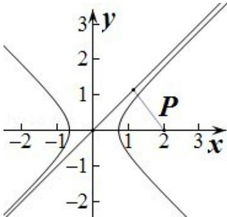

<!-- question-source:start -->
7. (5分) (2008·四川) 若点 P(2,0) 到双曲线 $\frac{x^{2}}{a^{2}} - \frac{y^{2}}{b^{2}} = 1$ 的一条渐近线的距离为 $\sqrt{2}$ ，则双曲线的离心率为（）

A. $\sqrt{2}$ B. $\sqrt{3}$ C. $2\sqrt{2}$ D. $2\sqrt{3}$

【考点】双曲线的简单性质.

【专题】计算题.

【
<!-- question-source:end -->

![[高中/真题/按年份分类/2008/2008年四川省高考数学试卷_文科_延考卷答案与解析/选择题/题目/answers/Q00022159A1.md]]
