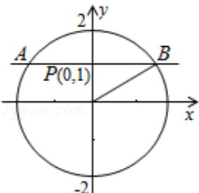

<!-- question-source:start -->
9. (5 分) (2008·四川) 过点 (0,1) 的直线与圆 $x^{2} + y^{2} = 4$ 相交于 A, B 两点, 则 |AB| 的最小值为 ( )

A.2B. $2\sqrt{3}$ C.3D. $2\sqrt{5}$

【考点】直线与圆的位置关系.

【
<!-- question-source:end -->

![[高中/真题/按年份分类/2008/2008年四川省高考数学试卷_文科_延考卷答案与解析/选择题/题目/answers/Q00022161A1.md]]
