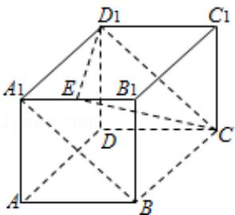

> [!faq]- 2008年四川省高考数学试卷(文科)延考卷答案与解析解析
>
> > [!success]- **【答案】** B
>
> > [!note]- **【分析】**
> > 在正方体、长方体中往往可以建立空间直角坐标系，利用向量法解决问题.
>
> > [!note]- **【解析】**
> > 解：如图，以D为坐标系原点，AB为单位长，DA，DC， $DD_{1}$ 分别为x,y,z轴建立坐标系，
> > 易见 $\overrightarrow{A_{1}B}=(0,1,-1)$ ， $\overrightarrow{D_{1}E}=(1,\frac{1}{2},0)$ 所以 $\cos<\overrightarrow{A_{1}B}$ ， $\overrightarrow{D_{1}E}>$ $=(0,1,-1)\cdot(1,\frac{1}{2},0)$ $|(0,1,-1)|\cdot|(1,\frac{1}{2},0)|$ $=\frac{\frac{1}{2}}{\sqrt{2}\cdot\sqrt{\frac{5}{4}}}$ $=\frac{\sqrt{10}}{10}$ 故选 B.
> >
> > 
> >
> > 【点评】本题考查空间两直线夹角的求法.
> >
> > ##
