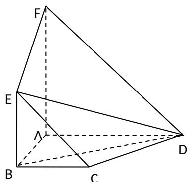

<!-- question-source:start -->
19. 如图, 面 $ABEF \perp$ 面 $ABCD$ , 四边形 $ABEF$ 与 $ABCD$ 都是直角梯形, $\angle BAD = \angle BAF = 90^{\circ}$ , $BC \parallel \frac{1}{2} AD$ , $BE \parallel \frac{1}{2} AF$ .

（Ⅰ）求证：C、D、E、F四点共面；

（Ⅱ）若 BA = BC = BE ，求二面角 A - ED - B 的大小.
<!-- question-source:end -->

![[高中/真题/按年份分类/2008/2008年四川高考理科数学_非延考区_试题及答案详解/解答题/题目/answers/Q00026647A1.md]]
