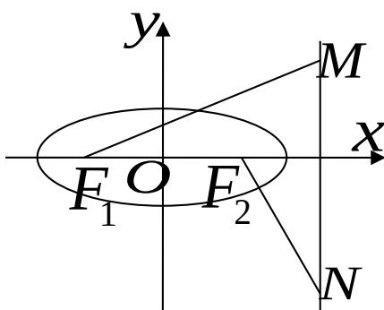

<!-- question-source:start -->
21. 设椭圆 $\frac{x^{2}}{a^{2}} + \frac{y^{2}}{b^{2}} = 1 (a > b > 0)$ 的左、右焦点分别是 $F_{1}$ 、 $F_{2}$ ，离心率 $e = \frac{\sqrt{2}}{2}$ ，右准线 l 上的两动点 M、N，且 $F_{1}M \cdot F_{2}N = 0$ 。

（Ⅰ）若 $\left|F_{1}M\right|=\left|F_{2}N\right|=2\sqrt{5}$ ，求a、b的值；

（Ⅱ）当 $\left|MN\right|$ 最小时，求证 $F_{1}M+F_{2}N$ 与 $F_{1}F_{2}$ 共线.

<!-- question-source:end -->

![[高中/真题/按年份分类/2008/2008年四川高考理科数学_非延考区_试题及答案详解/解答题/题目/answers/Q00026649A1.md]]
