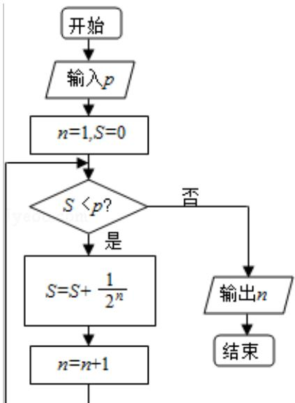

<!-- question-source:start -->
13. (4分) (2008·山东) 执行如图所示的程序框图, 若 $p = 0.8$ , 则输出的 $n =$ \_\_\_\_.

<!-- question-source:end -->

![[高中/真题/按年份分类/2008/2008年山东省高考数学试卷_理科_word版试卷及解析/填空题/题目/answers/Q00025854A1.md]]
