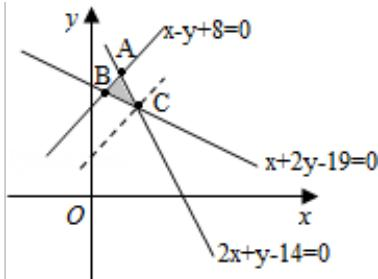

> [!faq]- 2008年山东省高考数学试卷(理科)word版试卷及解析解析
>
> > [!success]- **【答案】** C
>
> > [!note]- **【分析】**
> > 先依据不等式组 $\left\{ \begin{array}{l} x + 2y - 19 \geqslant 0 \\ x - y + 8 \geqslant 0 \\ 2x + y - 14 \leqslant 0 \end{array} \right.$ , 结合二元一次不等式 (组) 与平面区域的关系画出
>
> > [!note]- **【解析】**
> > 平面区域 M 如如图所示.
> >
> > 求得 A (2,10), C (3,8), B (1,9).
> >
> > 由图可知, 欲满足条件必有 $a > 1$ 且图象在过 B、C 两点的图象之间.
> >
> > 当图象过 B 点时, $a^{1} = 9$ , $\therefore a = 9$ .
> >
> > 当图象过 C 点时, $a^{3} = 8$ , $\therefore a = 2$ .
> >
> > 故 a 的取值范围为 [2,9=].
> >
> > 故选 C.
> >
> > [Figure]
> >
> > 
> >
> > ##
> > 二、填空题（共4小题，每小题4分，满分16分）
